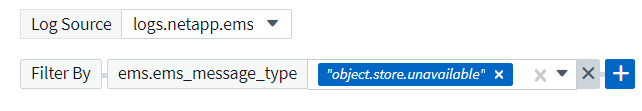

= 向监控器发出警报

[role="lead"]
您可以创建监控器来设置触发警报的阈值，以便向您通知与网络中资源相关的问题。例如，您可以创建一个监控器，以便针对任意多种协议发出 _node write latency 警报。

TIP: Cloud Insights 标准版及更高版本提供了监控和警报功能。

达到或超过受监控的阈值和条件时， Cloud Insights 将创建警报。一个监控器可以具有 _Warning_ 阈值， _critical_ 阈值，也可以同时具有这两者。

您可以使用监控器为 " 基础架构 " 对象（例如存储， VM ， EC2 和端口）以及 " 集成 " 数据（例如为 Kubernetes ， ONTAP 高级指标和 Telegraf 插件收集的数据）设置阈值。监控超过阈值时向您发出的警报，您可以设置警告级别警报，严重级别警报或两者的阈值。

请参见下面的 link:#system-defined-monitors-preview["系统定义的监控器"] 预览文档。

=== 创建监控器

在以下示例中，我们将创建一个监控器，以便在 _Volume Node NFS 写入延迟 _ 达到或超过 200 毫秒时发出警告警报，并在达到或超过 400 毫秒时发出严重警报。我们只希望在超过任一阈值至少持续 15 分钟时收到警报。

==== 要求

* 必须配置 Cloud Insights 以收集集成数据，并且正在收集该数据。

==== 创建监控器

. 从 Cloud Insights 菜单中，单击 * 警报 > 管理监控器 *
+
此时将显示监控器列表页面，其中显示了当前配置的监控器。

. 要添加监控器，请单击 * + Monitor* 。要修改现有监控器，请单击列表中的监控器名称。
+
此时将显示 Monitor Configuration 对话框。

. 在下拉列表中，搜索并选择要监控的对象类型和指标，例如 _netapp_ontap_volume_node_nfs_write_latter_ 。

您可以设置筛选器以缩小要监控的对象属性或指标范围。

image:MonitorMetricFilter.png["指标筛选"]

使用集成数据（ Kubernetes ， ONTAP 高级数据等）时，指标筛选会从绘制的数据系列中删除单个 / 不匹配的数据点，而不像基础架构数据（存储， VM ，端口等）那样，基础架构数据（存储， VM ，端口等）中的筛选器会处理数据系列的聚合值，并可能从图表中删除整个对象。

TIP: 要创建多条件监控器（例如， IOPS > X 和延迟 > Y ），请将第一个条件定义为阈值，将第二个条件定义为筛选器。

==== 定义监控器的条件。

. 选择要监控的对象和指标后，设置警告级别和 / 或严重级别阈值。
. 对于 _Warning_ 级别，输入 200 。指示此警告级别的虚线显示在示例图中。
. 对于 _critical_ 级别，输入 400 。指示此严重级别的虚线显示在示例图中。
+
此图显示历史数据。图中的 " 警告 " 和 " 严重 " 级别行是监控器的可视表示，因此您可以轻松查看监控器在每种情况下何时可能触发警报。

. 对于发生时间间隔，请选择 _continuous_ ，持续时间为 _15 分钟。
+
您可以选择在违反阈值时触发警报，或者等待阈值在一段时间内持续违反。在我们的示例中，我们不希望在总 IOPS 峰值高于 " 警告 " 或 " 严重 " 级别时都收到警报，但仅当受监控对象持续超过其中一个级别至少 15 分钟时才会收到警报。

+
image:define_monitor_conditions.png["定义条件"]

==== 细化筛选器

筛选时，在开始键入时，系统会根据当前文本显示一个 * 通配符筛选器 * 。选择此选项将返回与通配符表达式匹配的所有结果。您也可以使用 NOT 或 OR 创建 * 表达式 * ，也可以选择 " 无 " 选项来筛选字段中的空值。

image:Type-Ahead_Monitor_1.png["通配符筛选器"]

基于通配符或表达式（例如 NOT ， OR ， "None" 等）在筛选器字段中显示为深蓝色。您直接从列表中选择的项目将以淡蓝色显示。

image:Type-Ahead-Example-Wildcard-DirectSelect.png["通配符筛选器结果"]

请注意，通配符和表达式筛选适用于文本或列表，但不适用于数值，日期或布尔值。

=== 设置更正操作或追加信息

您可以通过填写 * 添加警报问题描述 * 部分来添加可选的问题描述以及其他见解和 / 或更正操作。问题描述最多可以包含 1024 个字符，并将随警报一起发送。洞察力 / 更正操作字段最多可包含 67 ， 000 个字符，并将显示在警报登录页面的摘要部分中。

在这些字段中，您可以提供注释，链接或更正警报或以其他方式解决警报的步骤。

image:Monitors_Alert_Description.png["警报更正操作和问题描述"]

=== 选择通知类型和收件人

在 _set up team notification （ s ） _ 部分中，您可以选择是通过电子邮件还是 Webhook 向您的团队发出警报。

image:Webhook_Choose_Monitor_Notification.png["选择警报方法"]

* 通过电子邮件警报： *

指定警报通知的电子邮件收件人。如果需要，您可以为警告或严重警报选择不同的收件人。

image:email_monitor_alerts.png["通过电子邮件发送警报收件人"]

* 通过 Webhook 警报： *

指定警报通知的 webhook 。如果需要，您可以为警告或严重警报选择不同的网络挂钩。

image:Webhook_Monitor_Notifications.png["webhook 警报"]

=== 保存您的显示器

. 如果需要，您可以添加监控器的问题描述。
. 为 Monitor 指定一个有意义的名称，然后单击 * 保存 * 。
+
新的监控器将添加到活动监控器列表中。

=== 监控列表

" 监控 " 页面列出了当前配置的监控器，显示以下内容：

* 监控器名称
* 状态
* 正在监控的对象 / 指标
* 监控器的条件

您可以通过单击监控器名称旁边的铃形图标来查看与监控器关联的任何活动警报。image:ViewActiveAlerts.png["显示监控器活动警报的图标"]

您可以通过单击监控器右侧的菜单并选择 * 暂停 * 来选择临时暂停监控某个对象类型。准备好恢复监控后，单击 * 恢复 * 。

您可以从菜单中选择 * 复制 * 来复制监控器。然后，您可以修改新的监控器并更改对象 / 指标，筛选器，条件，电子邮件收件人等

如果不再需要显示器，您可以从菜单中选择 * 删除 * 来将其删除。

== 监控组

通过分组，您可以查看和管理相关监控器。例如，您可以为环境中的存储配置一个专用监控组，也可以为特定收件人列表配置相关监控器。

image:Monitors_GroupList.png["监控分组"]

组名称旁边会显示组中包含的监控器数量。

要创建新组，请单击 "+" 创建新监控组 * 按钮。输入组的名称，然后单击 * 创建组 * 。此时将创建一个具有此名称的空组。

要向组中添加监控器，请转到 _all monitors_ 组（建议）并执行以下操作之一：

* 要添加单个显示器，请单击该显示器右侧的菜单，然后选择 _Add to Group_ 。选择要将监控器添加到的组。
* 单击监控器名称以打开监控器的编辑视图，然后在 _Associate to a monitor group_ 部分中选择一个组。
+
image:Monitors_AssociateToGroup.png["与组关联"]

通过单击某个组并从菜单中选择 _Remove from Group_ 来删除监控器。您不能从 _all monitors_ 或 _Custom Monitors_ 组中删除监控器。要从这些组中删除监控器，必须删除该监控器本身。

NOTE: 从组中删除监控器不会从 Cloud Insights 中删除该监控器。要完全删除某个监控器，请选择该监控器，然后单击 _Delete_ 。此操作还会将其从所属组中删除，并且任何用户都无法再使用它。

您也可以按相同方式将显示器移动到其他组，选择 _move to Group_ 。

NOTE: 在任何给定时间，每个监控器只能属于一个组。

要一次性暂停或恢复组中的所有监视器，请选择该组的菜单，然后单击 _Pause_ 或 _Resume_ 。

使用同一菜单重命名或删除组。删除组不会从 Cloud Insights 中删除这些监控器；它们在 _all monitors_中 仍然可用。

image:Monitors_PauseGroup.png["暂停组"]

== 系统定义的监控器（预览）

从 2021 年 10 月开始， Cloud Insights 将预览许多系统定义的指标和日志监控器。监控器界面将进行多项更改，以适应这些系统监控器。本节将介绍这些内容。

NOTE: 由于系统定义的监控器是一项预览功能，因此可能会发生更改。

==== 创建监控器

. 从 Cloud Insights 菜单中，单击 * 警报 > 管理监控器 *
+
此时将显示监控器列表页面，其中显示了当前配置的监控器。

. 要修改现有监控器，请单击列表中的监控器名称。
. 要添加监控器，请单击 * + Monitor* 。
+
image:Monitor_log_or_metric.png["选择系统或日志监控器"]

+
添加新监控器时，系统会提示您创建指标监控器或日志监控器。

+
** _Metric _ 监控与基础架构或性能相关的触发器的警报
** _Log_ 监控日志相关活动的警报

+
选择监控器类型后，将显示监控器配置对话框。

=== 指标监控器

. 在下拉列表中，搜索并选择要监控的对象类型和指标。

您可以设置筛选器以缩小要监控的对象属性或指标范围。

image:MonitorMetricFilter.png["指标筛选"]

使用集成数据（ Kubernetes ， ONTAP 高级数据等）时，指标筛选会从绘制的数据系列中删除单个 / 不匹配的数据点，而不像基础架构数据（存储， VM ，端口等）那样，基础架构数据（存储， VM ，端口等）中的筛选器会处理数据系列的聚合值，并可能从图表中删除整个对象。

TIP: 要创建多条件监控器（例如， IOPS > X 和延迟 > Y ），请将第一个条件定义为阈值，将第二个条件定义为筛选器。

==== 定义监控器的条件。

. 选择要监控的对象和指标后，设置警告级别和 / 或严重级别阈值。
. 对于 _Warning_ 级别，为我们的示例输入 200 。指示此警告级别的虚线显示在示例图中。
. 对于 _critical_ 级别，输入 400 。指示此严重级别的虚线显示在示例图中。
+
此图显示历史数据。图中的 " 警告 " 和 " 严重 " 级别行是监控器的可视表示，因此您可以轻松查看监控器在每种情况下何时可能触发警报。

. 对于发生时间间隔，请选择 _continuous_ ，持续时间为 _15 分钟。
+
您可以选择在违反阈值时触发警报，或者等待阈值在一段时间内持续违反。在我们的示例中，我们不希望在总 IOPS 峰值高于 " 警告 " 或 " 严重 " 级别时都收到警报，但仅当受监控对象持续超过其中一个级别至少 15 分钟时才会收到警报。

+
image:Monitor_metric_conditions.png["定义监控器的条件"]

=== 日志监控器

在 * 日志监控器 * 中，首先从可用日志列表中选择要监控的日志。然后，您可以根据上述可用属性进行筛选。

例如，您可以选择筛选 logs.netapp.ems 源中的 "object.store.unavailabe" 消息类型：

NOTE: 日志监控器筛选器不能为空。

==== 定义警报行为

选择在触发日志警报时要发出警报的方式。您可以根据上述筛选条件将监控器设置为具有 _Warning_ ， _critical_ 或 _Informational_ 严重性的警报。

image:Monitor_log_alert_behavior.png["定义要监控的日志行为"]

==== 定义警报解析行为

您可以选择如何解决日志监控警报。您可以选择三种方式：

* * 立即解决 * ：立即解决警报，无需采取进一步操作
* * 基于时间解决 * ：在指定时间过后，警报将得到解决
* * 基于日志条目解决 * ：在发生后续日志活动时解决警报。例如，当对象记录为 " 可用 " 时。

image:Monitor_log_monitor_resolution.png["警报解决"]

==== 选择通知类型和收件人

在 _set up team notification （ s ） _ 部分中，您可以选择是通过电子邮件还是 Webhook 向您的团队发出警报。

image:Webhook_Choose_Monitor_Notification.png["选择警报方法"]

* 通过电子邮件警报： *

指定警报通知的电子邮件收件人。如果需要，您可以为警告或严重警报选择不同的收件人。

image:email_monitor_alerts.png["通过电子邮件发送警报收件人"]

* 通过 Webhook 警报： *

指定警报通知的 webhook 。如果需要，您可以为警告或严重警报选择不同的网络挂钩。

image:Webhook_Monitor_Notifications.png["webhook 警报"]

NOTE: webhooks 被视为预览功能，因此可能会发生更改。

=== 设置更正操作或追加信息

您可以通过填写 * 添加警报问题描述 * 部分来添加可选的问题描述以及其他见解和 / 或更正操作。问题描述最多可以包含 1024 个字符，并将随警报一起发送。洞察力 / 更正操作字段最多可包含 67 ， 000 个字符，并将显示在警报登录页面的摘要部分中。

在这些字段中，您可以提供注释，链接或更正警报或以其他方式解决警报的步骤。

image:Monitors_Alert_Description.png["警报更正操作和问题描述"]

=== 保存您的显示器

. 如果需要，您可以添加监控器的问题描述。
. 为 Monitor 指定一个有意义的名称，然后单击 * 保存 * 。
+
新的监控器将添加到活动监控器列表中。

=== 监控列表

" 监控 " 页面列出了当前配置的监控器，显示以下内容：

* 监控器名称
* 状态
* 正在监控的对象 / 指标
* 监控器的条件

您可以通过单击监控器右侧的菜单并选择 * 暂停 * 来选择临时暂停监控某个对象类型。准备好恢复监控后，单击 * 恢复 * 。

您可以从菜单中选择 * 复制 * 来复制监控器。然后，您可以修改新的监控器并更改对象 / 指标，筛选器，条件，电子邮件收件人等

如果不再需要显示器，您可以从菜单中选择 * 删除 * 来将其删除。

== 监控组

通过分组，您可以查看和管理相关监控器。例如，您可以为环境中的存储配置一个专用监控组，也可以为特定收件人列表配置相关监控器。

image:Monitors_GroupList.png["监控分组"]

组名称旁边会显示组中包含的监控器数量。

NOTE: 自定义监控器可以暂停，恢复，删除或移动到其他组。系统定义的监控器可以暂停和恢复，但不能删除或移动。

=== 自定义监控组

要创建新的自定义监控组，请单击 * "+" 创建新监控组 * 按钮。输入组的名称，然后单击 * 创建组 * 。此时将创建一个具有此名称的空组。

要向组中添加监控器，请转到 _all monitors_ 组（建议）并执行以下操作之一：

* 要添加单个显示器，请单击该显示器右侧的菜单，然后选择 _Add to Group_ 。选择要将监控器添加到的组。
* 单击监控器名称以打开监控器的编辑视图，然后在 _Associate to a monitor group_ 部分中选择一个组。
+
image:Monitors_AssociateToGroup.png["与组关联"]

通过单击某个组并从菜单中选择 _Remove from Group_ 来删除监控器。您不能从 _all monitors_ 或 _Custom Monitors_ 组中删除监控器。要从这些组中删除监控器，必须删除该监控器本身。

NOTE: 从组中删除监控器不会从 Cloud Insights 中删除该监控器。要完全删除某个监控器，请选择该监控器，然后单击 _Delete_ 。此操作还会将其从所属组中删除，并且任何用户都无法再使用它。

您也可以按相同方式将显示器移动到其他组，选择 _move to Group_ 。

NOTE: 在任何给定时间，每个监控器只能属于一个组（除了属于 " 所有监控器 " 和 " 自定义监控器 " 之外）。

要一次性暂停或恢复组中的所有监视器，请选择该组的菜单，然后单击 _Pause_ 或 _Resume_ 。

使用同一菜单重命名或删除组。删除组不会从 Cloud Insights 中删除这些监控器；它们在 _all monitors_中 仍然可用。

image:Monitors_PauseGroup.png["暂停组"]

=== 系统定义的监控器

系统定义的监控器由预定义的指标和条件以及默认说明和更正操作组成，这些内容无法修改。您可以修改系统定义的监控器的通知收件人列表。要查看指标，条件，问题描述和更正操作，或者修改收件人列表，请打开系统定义的监控组，然后单击列表中的监控器名称。

无法修改或删除系统定义的监控组。

以下系统定义的监控器可在所记录的组中使用。

* * ONTAP Infrastructure* 可监控 ONTAP 集群中与基础架构相关的问题。
* * ONTAP 工作负载示例 * 包括与工作负载相关的问题的监控器。
* 两个组中的监控器默认为 _Paused_state 。

|===

| 监控器名称 | severity | 监控问题描述 | 更正操作 

| 已超过 WAFL 配额 qtree | 信息 | 如果卷上的树配额已超过，则会发生此事件。此树在一定时间内或在执行 " 配额调整大小 " 之前不会重复此事件。时间量由 "quota logmsg" 命令指定。 | 减少此树中的使用量或增加配额并运行 "quota resize" 命令。 

| 卷自动调整大小成功 | 信息 | " 如果卷的自动大小调整成功，则会发生此事件。如果启用了 "autosize grow" 选项，并且卷达到增长阈值百分比，则会发生这种情况。 " | 无 

| 卷自动调整大小失败 | 警告 | 卷的自动大小调整失败。如果不采取更正操作，卷可能会用尽空间。 | 分析自动调整大小失败的原因：卷是否已达到其最大容量？存储池（聚合）是否空间不足？自动调整卷大小时，增加卷的最大容量。 

| SnapMirror 关系不同步 | 严重 | 如果 SnapMirror （ R ） Sync 关系状态从 " 同步 " 更改为 " 不同步 " ，则会发生此事件。根据复制模式对源卷施加 I/O 限制。对于 "trict-sync-mirror" 策略类型的关系，不允许客户端对卷进行读写访问。数据保护受到影响。 | 检查源卷和目标卷之间的网络连接。使用 "snapmirror show" 命令监控 SnapMirror 同步关系状态。"Auto-resync" 尝试将关系恢复为 "in-sync" 状态。 

| SAN 的 " 主动 - 主动 " 状态已更改 | 警告 | " SAN 路径不再对称。路径只能在 ASA 上不对称，因为 AFF 和 FAS 都是不对称的。 " | 尝试并启用 "active-active" 状态。如果问题仍然存在，请联系客户支持。 " 

| QoS 监控内存已达到上限 | 严重 | QoS 子系统的动态内存已达到当前平台硬件的限制。某些 QoS 功能可能在有限容量下运行。 | " 删除某些活动工作负载或流以释放内存。使用 "statistics show -object workload -counter ops" 命令确定哪些工作负载处于活动状态。活动工作负载显示非零操作。然后，多次使用 "workload delete <workload_name>" 命令删除特定工作负载。或者，也可以使用 "tream delete -workload <workload name> * " 命令从活动工作负载中删除关联的流。 " 

| NVMe 命名空间联机 | 信息 | 手动使 NVMe 命名空间联机时会发生此事件。 | 无 

| NVMe 命名空间脱机 | 信息 | 手动使 NVMe 命名空间脱机时会发生此事件。 | 无 

| NVMe 命名空间已销毁 | 信息 | 销毁 NVMe 命名空间时会发生此事件。 | 无 

| 无响应的防病毒服务器 | 信息 | 如果 ONTAP （ R ）检测到无响应防病毒（ AV ）服务器并强制关闭其 Vscan 连接，则会发生此事件。 | 确保安装在 AV 连接器上的 AV 服务器可以连接到 Storage Virtual Machine （ SVM ）并接收扫描请求。 

| LUN 已销毁 | 信息 | 销毁 LUN 时会发生此事件。 | 无 

| 已超过 FC 目标端口命令 | 警告 | 物理 FC 目标端口上未处理的命令数超过支持的限制。此端口没有足够的缓冲区来容纳未完成的命令。由于启动程序 I/O 太多，因此发生超限或扇入过陡。 | 执行以下更正操作： "1.评估端口上的主机扇入，并执行以下操作之一： " a.减少登录到此端口的主机数量。B减少登录到此端口的主机访问的 LUN 数量。c.减小 host 命令队列深度。2.监控 "FCP_port" CM 对象上的 "queue_full" 计数器，并确保其不会增加。例如： " statistics show -object fcp_port -counter queue_full -instance port.portname -raw 3.监控阈值计数器并确保其不会增加。例如： statistics show -object fcp_port -counter threshold_full -instance port.portname -raw 

| LUN 脱机 | 信息 | 手动使 LUN 脱机时会发生此事件。 | 将 LUN 恢复联机。 

| AWS 凭据未初始化 | 信息 | 如果模块在初始化之前尝试从云凭据线程访问 Amazon Web Services （ AWS ）身份和访问管理（ IAM ）基于角色的凭据，则会发生此事件。 | " 等待云凭据线程以及系统完成初始化。" 

| 无法访问云层 | 严重 | 存储节点无法连接到 Cloud Tier 对象存储 API 。某些数据将无法访问。 | " 如果您使用内部产品，请执行以下更正操作： "1.使用 "network interface show" 命令验证集群间 LIF 是否联机且正常运行。 "2.通过对目标节点集群间 LIF 使用 "ping" 命令检查与对象存储服务器的网络连接。 3.确保满足以下条件： a.对象存储的配置未更改。B登录和连接信息仍然有效。如果问题描述仍然存在，请联系 NetApp 技术支持。" 如果使用 Cloud Volumes ONTAP ，请执行以下更正操作： " 1.确保对象存储的配置未更改。2. 确保登录和连接信息仍然有效。如果问题描述仍然存在，请联系 NetApp 技术支持。 

| FlexGroup 成分卷已用尽索引节点 | 严重 | " FlexGroup 卷的成分卷已用尽索引节点，这可能会导致发生原因服务中断。您不能在此成分卷上创建新文件。这可能会导致整个 FlexGroup 卷中的内容分布不平衡。 " | 建议您使用 "volume modify -files +X" 命令向 FlexGroup 卷添加容量。 " 或者，从 FlexGroup 卷中删除文件。但是，很难确定哪些文件已登录到成分卷上。 " 

| FlexGroup 成分卷接近索引节点数 | 警告 | " FlexGroup 卷中的成分卷几乎没有索引节点，这可能会导致发生原因服务中断。成分卷收到的创建请求小于平均值。这可能会影响 FlexGroup 卷的整体性能，因为请求会路由到索引节点数更多的成分卷。 " | 建议您使用 "volume modify -files +X" 命令向 FlexGroup 卷添加容量。 " 或者，从 FlexGroup 卷中删除文件。但是，很难确定哪些文件已登录到成分卷上。 " 

| FlexGroup 成分卷完整 | 严重 | " FlexGroup 卷中的成分卷已满，这可能发生原因会导致服务中断。您仍然可以在 FlexGroup 卷上创建或扩展文件。但是，不能修改成分卷上存储的任何文件。因此，在尝试对 FlexGroup 卷执行写入操作时，可能会出现随机的空间不足错误。 " | 建议您使用 "volume modify -files +X" 命令向 FlexGroup 卷添加容量。 " 或者，从 FlexGroup 卷中删除文件。但是，很难确定哪些文件已登录到成分卷上。 " 

| FlexGroup 成分卷已接近全满 | 警告 | " FlexGroup 卷中的成分卷空间几乎用尽，这可能会导致发生原因服务中断。可以创建和扩展文件。但是，如果成分卷用尽空间，您可能无法附加到成分卷上的文件或对其进行修改。" | 建议您使用 "volume modify -files +X" 命令向 FlexGroup 卷添加容量。 " 或者，从 FlexGroup 卷中删除文件。但是，很难确定哪些文件已登录到成分卷上。 " 

| 未配置服务处理器 | 警告 | " 此事件每周发生一次，提醒您配置服务处理器（ SP ）。SP 是一种物理设备，集成在您的系统中，用于提供远程访问和远程管理功能。您应将 SP 配置为使用其全部功能。" | 执行以下更正操作： "1.使用 "system service-processor network modify" 命令配置 SP 。 "2.或者，也可以使用 "system service-processor network show" 命令获取 SP 的 MAC 地址。 "3.使用 system service-processor network show 命令验证 SP 网络配置。 "4.使用 "system service-processor AutoSupport invoke" 命令验证 SP 是否可以发送 AutoSupport 电子邮件。 注意：在问题描述此命令之前，应在 ONTAP 中配置 AutoSupport 电子邮件主机和收件人。 

| 服务处理器脱机 | 严重 | ONTAP 不再从服务处理器（ SP ）接收检测信号，即使已执行所有 SP 恢复操作也是如此。如果没有 SP ， ONTAP 将无法监控硬件的运行状况。 " | 通过执行以下操作重新启动系统：系统将关闭以防止硬件损坏和数据丢失。设置崩溃警报，以便在 SP 脱机时立即收到通知。1. 将控制器从机箱中拉出。2. 推回控制器。3. 重新打开控制器。' 如果问题仍然存在，请更换控制器模块。 ' 

| 未分配的磁盘 | 信息 | 系统具有未分配的磁盘 - 正在浪费容量，并且您的系统可能会应用某些配置错误或部分配置更改。 | 执行以下更正操作： "1.使用 "disk show -n" 命令确定哪些磁盘未分配。 "2.使用 "disk assign" 命令将磁盘分配给系统。 

| 由于风扇故障，系统无法运行 | 严重 | " 一个或多个主单元风扇发生故障，导致系统运行中断。这可能会导致数据丢失。" | 更换发生故障的风扇。 

| 风扇出现故障 | 警告 | 一个或多个主单元风扇出现故障。系统仍可正常运行。 | " 重新拔插故障风扇。如果此错误仍然存在，请更换它们。 " " 但是，如果此情况持续时间过长，则过热可能会触发自动关闭。 " 

| 风扇处于警告状态 | 信息 | 如果一个或多个风扇处于警告状态，则会发生此事件。 | 更换指示的风扇以避免过热。 

| NVRAM 电池电量低 | 警告 | NVRAM 电池容量严重不足。如果电池电量耗尽，可能会丢失数据。 | 执行以下更正操作： " 您的系统会生成 AutoSupport 或 "call home" 消息并将其传输到 NetApp 技术支持和已配置的目标（如果已配置此消息）。成功传送 AutoSupport 消息可显著提高问题的确定和解决能力。 " "1.使用 "system node environment sensors show" 命令查看电池的当前状态，容量和充电状态。 "2.如果最近更换了电池或系统长时间不运行，请监控电池以确认其充电正常。 " "3.如果电池运行时间持续降低到临界水平以下，并且存储系统自动关闭，请联系 NetApp 技术支持。 " 

| 磁盘已停止服务 | 信息 | " 如果磁盘因标记为故障，正在清理或已进入维护中心而从服务中删除，则会发生此事件。 " | 无 

| 存储交换机风扇出现故障 | 严重 | ' 磁盘架中指示的散热风扇或风扇模块出现故障。磁盘架中的磁盘可能无法获得足够的散热气流，从而可能导致磁盘故障。 " | 执行以下更正操作： 1.验证风扇模块是否已完全就位并固定。注：风扇集成在某些磁盘架的电源模块中。2.如果问题描述仍然存在，请更换风扇模块。 ' "3.如果此问题描述仍然存在，请联系 NetApp 技术支持以获得帮助。 " 
|===

=== 更多信息

* link:task_view_and_manage_alerts.html["查看和忽略警报"]

